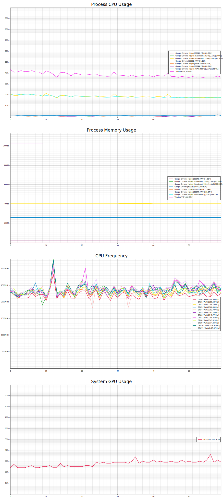

# precord

[](https://crates.io/crates/precord)
[](https://docs.rs/precord)


A command line tool to record process and system performance data.

</img>

## Installation

Install with `cargo`:

```shell
cargo install precord
```

## Usage

```shell
precord -p 1203 -o result.svg
```

### Options

- `-c / --category` - categories for recording, possible values:
  - `cpu`- CPU usage of process
  - `mem`- Memory usage of process
  - `gpu`- GPU usage of process
  - `fps`- Frame rate of process
  - `sys_cpu_freq`- CPU frequency of system
  - `sys_gpu`- GPU usage of system
- `-p / --process` - ID of processes
- `--name` - Name of processes
- `-o / --output` - Output of recording result, possible extensions:
  - `.svg`
  - `.json`
  - `.csv`
- `-i / --interval` - Interval of recording
- `-n` - Count of recording
- `-r / --recurse_children` - Flag to recurse child processes

## precord-core

A library for retrieving process and system performance data.

```rust
use precord_core::{Features, System};
use std::thread;
use std::time::Duration;

fn main() {
  let mut system = System::new(Features::PROCESS || Features::GPU, [1203]);
  system.update();
  
  thread::sleep(Duration::from_secs(1));
  system.update();

  if let Some(cpu_usage) = system.process_cpu_usage(1203) {
    println!("Process({}) %CPU: {:.2}%", 1203, cpu_usage)
  }
  
  #[cfg(target_os = "windows")]
  if let Some(gpu_usage) = system.process_gpu_usage(1203) {
    println!("Process({}) %GPU: {:.2}%", 1203, gpu_usage)
  }
  
  if let Some(sys_gpu_usage) = system.system_gpu_usage() {
    println!("System %GPU: {:.2}%", sys_gpu_usage);
  }
}
```

## Supported Platforms

|              | macOS              | Windows            |
|--------------|--------------------|--------------------|
| cpu          | :white_check_mark: | :white_check_mark: |
| mem          | :white_check_mark: | :white_check_mark: |
| gpu          |                    | :white_check_mark: |
| fps          |                    | :white_check_mark: |
| sys_cpu_freq | :white_check_mark: | :white_check_mark: |
| sys_gpu      | :white_check_mark: | :white_check_mark: |

## Privileges

|                                                    | macOS         | Windows       |
|----------------------------------------------------|---------------|---------------|
| cpu                                                |               |               |
| mem                                                |               |               |
| gpu                                                |               |               |
| fps                                                |               | Administrator |
| sys_cpu_freq                                       | Administrator |               |
| sys_gpu                                            |               |               |
| system processes<br/>(WindowServer, dwm.exe, etc.) | Administrator | Administrator |


## TODO

- [ ] Support Linux platform

## Related projects

- Rust
  - [sysinfo]
  - [heim]
  - [rust-psutil]

- Go
  - [gopsutil]

- Python
  - [psutil]

[sysinfo]: https://github.com/GuillaumeGomez/sysinfo
[heim]: https://github.com/heim-rs/heim
[rust-psutil]: https://github.com/rust-psutil/rust-psutil
[gopsutil]: https://github.com/shirou/gopsutil
[psutil]: https://github.com/giampaolo/psutil
